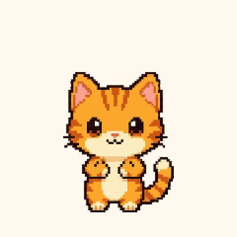

# Codex Pets

A tiny flame. A curious cat. A little company while you work.

一团温柔的小火焰，一只好奇的小橘猫，陪你度过工作时光。

| Lihuo · 离火心焰 | Yuzu · 橘猫 |
| :---: | :---: |
|  |  |
| **[Adopt Lihuo · 领取宠物](https://chatgpt.com/s/sharepet_6ac5c1a600888191a18d3ebc02d27aab)** | **[Adopt Yuzu · 领取宠物](https://chatgpt.com/s/sharepet_6ac5c1ac6c648191a76e72d201387c49)** |
| A gentle flame spirit for calm, focused days. | A bright little orange cat for curious, playful coding days. |
| 温柔的火焰精灵，陪你静心专注。 | 活泼好奇的小橘猫，陪你轻松探索与编程。 |

## Adopt in ChatGPT · 在 ChatGPT 中领取

Open a pet link above in ChatGPT and sign in to add an editable copy to your pet library.

打开上方宠物链接，登录 ChatGPT，即可将可编辑副本添加到你的虚拟宠物库。

## Download · 下载

| Character · 角色 | Animation · 动画 | Still preview · 静态预览 | Original sprite sheet · 原始精灵图 |
| :--- | :--- | :--- | :--- |
| Lihuo · 离火心焰 | [GIF](previews/lihuo.gif) | [PNG](previews/lihuo.png) | [PNG](assets/lihuo.png) |
| Yuzu · 橘猫 | [GIF](previews/yuzu.gif) | [PNG](previews/yuzu.png) | [PNG](assets/yuzu.png) |

## Files · 文件说明

```text
assets/     Original sprite sheets / 原始精灵图
previews/   Animated GIFs and still previews / 动画与静态预览
pets.json   Bilingual character names and descriptions / 双语名称与介绍
```

The original sprite sheets are transparent RGBA PNGs, each **1536 × 2288 px**. Each v2 sheet contains 73 frames with **192 × 208 px** cells, covering 9 animated states and 16 look directions. Download these for the full artwork; the preview files are for a quick look at the characters.

原始精灵图均为带透明背景的 RGBA PNG，尺寸为 **1536 × 2288 像素**。每份 v2 图集包含 73 帧，单格为 **192 × 208 像素**，涵盖 9 种动画状态及 16 个视线方向。下载原图可查看完整素材，预览文件方便快速了解角色。

If you like these little companions, give the repo a ⭐.

喜欢这两只小伙伴的话，欢迎点一颗 ⭐。
